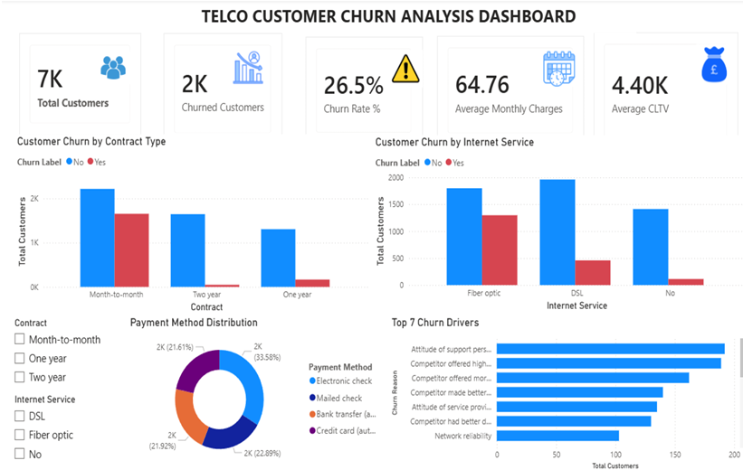

# 📊 Telecom Customer Churn Analysis

An end-to-end Data Analytics project analysing customer churn behaviour using **MySQL, Python and Power BI**.

---

## 📌 Project Overview

This project analyses customer churn patterns in a telecommunications company.

The workflow includes:

- SQL Business Analysis
- Data Cleaning & Preprocessing
- Exploratory Data Analysis (EDA)
- Customer Churn Prediction using Machine Learning
- Interactive Power BI Dashboard
- Business Recommendations

---

## 🛠️ Tools Used

- MySQL
- Python
- Pandas
- Matplotlib
- Seaborn
- Scikit-learn
- Google Colab
- Power BI

---

## 📂 Project Files

| File | Description |
|------|-------------|
| Customer_Churn_SQL_Analysis.sql | Complete SQL analysis |
| Telecom_Customer_Churn_SQL_Python_PowerBI_Portfolio.ipynb | Python analysis notebook |
| Dashboard.png | Power BI dashboard |
| telco_churn.csv | Dataset |

---

## 📈 Power BI Dashboard

---

## 🔍 SQL Analysis

Business questions answered:

- Overall Churn Rate
- Contract Type Analysis
- Internet Service Analysis
- Payment Method Analysis
- Monthly Charges Analysis
- CLTV Analysis
- Churn Reason Analysis
- Customer Segmentation
- Window Functions (RANK)
- KPI Reporting

---

## 🐍 Python Analysis

The notebook includes:

- Data Cleaning
- Missing Value Analysis
- Label Encoding
- Exploratory Data Analysis
- Correlation Heatmap
- Decision Tree Classification
- Model Evaluation
- Business Insights

---

## 📊 Dashboard KPIs

- Total Customers
- Churn Customers
- Churn Rate
- Average Monthly Charges
- Average CLTV

Interactive visuals include:

- Contract Type vs Churn
- Internet Service vs Churn
- Payment Method Distribution
- Top Churn Reasons

---

## 🤖 Machine Learning

Model Used:

- Decision Tree Classifier

Model Performance:

- Accuracy: **73.45%**

---

## 💡 Business Recommendations

- Encourage customers to move from month-to-month contracts to long-term plans.
- Focus retention campaigns on new customers.
- Improve customer support quality.
- Offer bundled services to increase customer value.
- Monitor high-value customers using CLTV.

---

## 👤 Author

**Jatin Asrani**

Data Analytics | SQL | Python | Power BI

GitHub: https://github.com/okayjatin

LinkedIn: www.linkedin.com/in/jatin-asrani-666a29154
